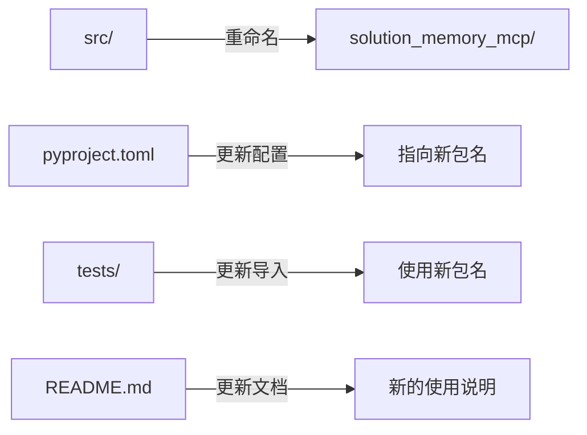

# 技术设计: 包名规范化重命名

## 1. 架构概述

将包目录从 `src/` 重命名为 `solution_memory_mcp/`，使其符合 Python 包命名规范，支持 PyPI 发布。



### 当前结构
```
solution-memory-mcp/
├── src/                    # 需重命名为 solution_memory_mcp/
│   ├── __init__.py
│   ├── __main__.py
│   ├── server.py
│   ├── models/
│   ├── search/
│   ├── storage/
│   └── tools/
├── tests/
│   └── test_storage.py     # 导入需更新
├── pyproject.toml          # 构建配置需更新
└── README.md               # 文档需更新
```

### 目标结构
```
solution-memory-mcp/
├── solution_memory_mcp/    # 新包名
│   ├── __init__.py
│   ├── __main__.py
│   ├── server.py
│   ├── models/
│   ├── search/
│   ├── storage/
│   └── tools/
├── tests/
├── pyproject.toml
└── README.md
```

## 2. 需要修改的文件

### 2.1 目录重命名
- `src/` → `solution_memory_mcp/`

### 2.2 pyproject.toml 更新
```toml
[project.scripts]
solution-memory-mcp = "solution_memory_mcp:main"  # 更新入口点

[tool.hatch.build.targets.wheel]
packages = ["solution_memory_mcp"]  # 更新包目录

[tool.hatch.build.targets.sdist]
include = ["solution_memory_mcp"]   # 更新包目录
```

### 2.3 测试文件导入更新
`tests/test_storage.py`:
```python
# 旧
from src.models.solution import Solution
from src.storage.sqlite_store import SQLiteStore
from src.storage.chroma_store import ChromaStore

# 新
from solution_memory_mcp.models.solution import Solution
from solution_memory_mcp.storage.sqlite_store import SQLiteStore
from solution_memory_mcp.storage.chroma_store import ChromaStore
```

### 2.4 README.md 更新
更新 Windsurf 配置示例中的 args:
```json
"args": ["-m", "solution_memory_mcp"]  # 原为 "-m", "src"
```

### 2.5 __init__.py 更新
添加 `main` 函数导出，支持命令行入口：
```python
from .server import main
__all__ = ["main", "__version__"]
```

## 3. 测试策略

### 单元测试
- 运行 `pytest tests/` 确保所有测试通过

### 集成测试
- 执行 `pip install -e .` 验证可编辑安装
- 执行 `solution-memory-mcp` 验证命令行入口
- 执行 `python -m solution_memory_mcp` 验证模块运行

### 发布前验证
- 执行 `pip install build && python -m build` 构建包
- 检查生成的 wheel 和 sdist 文件
