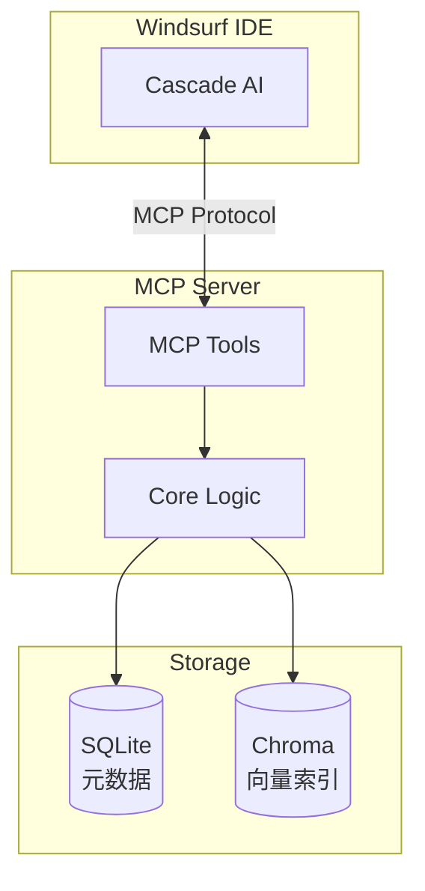

# 技术设计: 跨项目问题解决方案记忆系统 (Solution Memory)

## 1. 架构概述

系统采用 **MCP Server** 架构，作为 Windsurf/Cascade 的扩展服务运行。



### 技术栈
| 层级 | 技术选型 |
|------|----------|
| **运行时** | Python 3.11+ |
| **MCP 框架** | `mcp` (官方 Python SDK) |
| **元数据存储** | SQLite (内置) |
| **向量数据库** | Chroma (本地持久化) |
| **嵌入模型** | `all-MiniLM-L6-v2` (本地, 384维) |
| **全文搜索** | SQLite FTS5 (内置) |

---

## 2. 数据模型

### 2.1 SQLite Schema

```sql
-- 解决方案主表
CREATE TABLE solutions (
    id TEXT PRIMARY KEY,           -- UUID
    title TEXT NOT NULL,           -- 问题标题
    problem TEXT NOT NULL,         -- 问题描述
    root_cause TEXT,               -- 根因分析
    solution TEXT NOT NULL,        -- 解决方案
    error_messages TEXT,           -- 错误信息 (JSON array)
    project_name TEXT,             -- 来源项目
    created_at TIMESTAMP DEFAULT CURRENT_TIMESTAMP,
    updated_at TIMESTAMP DEFAULT CURRENT_TIMESTAMP
);

-- 标签表
CREATE TABLE tags (
    id INTEGER PRIMARY KEY AUTOINCREMENT,
    name TEXT UNIQUE NOT NULL,
    category TEXT NOT NULL         -- 'tech_stack' | 'problem_type' | 'error_code'
);

-- 解决方案-标签关联表
CREATE TABLE solution_tags (
    solution_id TEXT REFERENCES solutions(id) ON DELETE CASCADE,
    tag_id INTEGER REFERENCES tags(id) ON DELETE CASCADE,
    PRIMARY KEY (solution_id, tag_id)
);

-- 索引
CREATE INDEX idx_solutions_created_at ON solutions(created_at DESC);
CREATE INDEX idx_tags_category ON tags(category);

-- FTS5 全文搜索虚拟表
CREATE VIRTUAL TABLE solutions_fts USING fts5(
    title,
    problem,
    solution,
    error_messages,
    content='solutions',
    content_rowid='rowid'
);

-- 触发器：保持 FTS 索引同步
CREATE TRIGGER solutions_ai AFTER INSERT ON solutions BEGIN
    INSERT INTO solutions_fts(rowid, title, problem, solution, error_messages)
    VALUES (NEW.rowid, NEW.title, NEW.problem, NEW.solution, NEW.error_messages);
END;

CREATE TRIGGER solutions_ad AFTER DELETE ON solutions BEGIN
    INSERT INTO solutions_fts(solutions_fts, rowid, title, problem, solution, error_messages)
    VALUES ('delete', OLD.rowid, OLD.title, OLD.problem, OLD.solution, OLD.error_messages);
END;
```

### 2.2 Chroma Collection

```python
collection_config = {
    "name": "solution_embeddings",
    "metadata": {"hnsw:space": "cosine"},
    "embedding_function": SentenceTransformerEmbeddingFunction(
        model_name="all-MiniLM-L6-v2"
    )
}

# 存储结构
{
    "ids": ["solution_uuid"],
    "documents": ["problem + error_messages 拼接文本"],
    "metadatas": [{"solution_id": "uuid", "title": "..."}]
}
```

---

## 3. MCP 工具接口设计

### 3.1 save_solution

保存新的解决方案。

```typescript
interface SaveSolutionInput {
    title: string;              // 问题标题 (必填)
    problem: string;            // 问题描述 (必填)
    solution: string;           // 解决方案 (必填)
    root_cause?: string;        // 根因分析
    error_messages?: string[];  // 相关错误信息
    tags?: string[];            // 标签列表
    project_name?: string;      // 项目名称
}

interface SaveSolutionOutput {
    id: string;                 // 生成的 UUID
    message: string;            // 成功消息
}
```

### 3.2 search_solutions

**混合搜索**：结合关键词精确匹配 (FTS5) 和语义相似度 (向量) 搜索。

#### 混合搜索算法

```
最终分数 = α × semantic_score + (1-α) × keyword_score

其中 α = 0.6 (语义权重，可配置)
```

**搜索流程**：
1. 并行执行 FTS5 关键词搜索 + Chroma 向量搜索
2. 对两个结果集进行分数归一化 (0-1)
3. 使用 Reciprocal Rank Fusion (RRF) 或加权求和融合结果
4. 按综合分数排序返回

```typescript
interface SearchSolutionsInput {
    query: string;              // 搜索查询 (问题描述或错误信息)
    limit?: number;             // 返回数量 (默认 5, 最大 20)
    tags?: string[];            // 按标签过滤
    search_mode?: 'hybrid' | 'semantic' | 'keyword';  // 搜索模式 (默认 hybrid)
}

interface SearchSolutionsOutput {
    results: Array<{
        id: string;
        title: string;
        problem: string;        // 截断至 200 字符
        relevance: number;      // 0-1 综合相关性分数
        semantic_score: number; // 语义相似度
        keyword_score: number;  // 关键词匹配度
        project_name: string;
        created_at: string;
        tags: string[];
    }>;
    total: number;
}
```

### 3.3 get_solution

获取解决方案完整详情。

```typescript
interface GetSolutionInput {
    id: string;                 // 解决方案 UUID
}

interface GetSolutionOutput {
    id: string;
    title: string;
    problem: string;
    root_cause: string | null;
    solution: string;
    error_messages: string[];
    tags: string[];
    project_name: string;
    created_at: string;
    updated_at: string;
}
```

### 3.4 list_tags

列出所有标签，支持按类别过滤。

```typescript
interface ListTagsInput {
    category?: 'tech_stack' | 'problem_type' | 'error_code';
}

interface ListTagsOutput {
    tags: Array<{
        name: string;
        category: string;
        count: number;          // 关联的解决方案数量
    }>;
}
```

---

## 4. 核心组件

```
solution-memory-mcp/
├── src/
│   ├── __init__.py
│   ├── server.py              # MCP Server 入口
│   ├── tools/
│   │   ├── __init__.py
│   │   ├── save_solution.py   # save_solution 工具
│   │   ├── search_solutions.py# search_solutions 工具 (混合搜索)
│   │   ├── get_solution.py    # get_solution 工具
│   │   └── list_tags.py       # list_tags 工具
│   ├── storage/
│   │   ├── __init__.py
│   │   ├── sqlite_store.py    # SQLite + FTS5 操作封装
│   │   └── chroma_store.py    # Chroma 向量操作封装
│   ├── search/
│   │   ├── __init__.py
│   │   └── hybrid_search.py   # 混合搜索引擎 (FTS5 + 向量融合)
│   └── models/
│       ├── __init__.py
│       └── solution.py        # 数据模型定义
├── tests/
│   ├── test_save_solution.py
│   ├── test_search_solutions.py
│   └── test_storage.py
├── pyproject.toml             # 项目配置 & 依赖
└── README.md
```

---

## 5. 测试策略

| 测试类型 | 覆盖范围 |
|----------|----------|
| **单元测试** | 各工具的输入验证、数据转换逻辑 |
| **集成测试** | SQLite + Chroma 存储层交互 |
| **端到端测试** | MCP 协议完整调用流程 |

### 关键测试用例
1. 保存解决方案 → 搜索能找到
2. 搜索结果按相似度排序
3. 标签过滤正确工作
4. 空搜索结果返回空数组（不报错）
5. 并发写入不冲突

---

## 6. 配置与部署

### 6.1 数据存储位置

```
~/.solution-memory/
├── solutions.db               # SQLite 数据库
└── chroma/                    # Chroma 持久化目录
```

### 6.2 Windsurf MCP 配置

```json
{
  "mcpServers": {
    "solution-memory": {
      "command": "python",
      "args": ["-m", "solution_memory_mcp"],
      "env": {
        "SOLUTION_MEMORY_PATH": "~/.solution-memory"
      }
    }
  }
}
```

---

## 7. 未来扩展（不在本期范围）

- 解决方案版本历史
- 导出/导入功能
- Web UI 浏览器
- 多用户/团队共享
